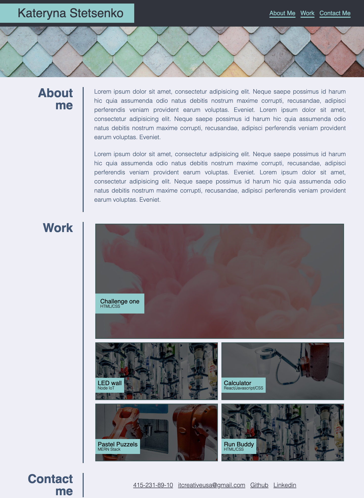

# Homework-Challenge-2 Webpage

## Description

Link to deployed application
https://itcreativeusa.github.io/Homework-Challenge-2/

Github link 
https://github.com/itcreativeusa/Homework-Challenge-2

This Homework-Challenge-2 website was created as a bootcamp everyweek student challege. This website is a HTML & CSS portfolio page. The code of this portfolio page was created from scratch. 
- HTML elemens "div" were replaced by semantic elements (header, figure, nav, main, aside, footer)
- Added alt attributes to icons & images
- Added descriptive title 
- Fixed navigation links
- Added comments to HTML index file before each element or section of the page
- CSS selectors & properties are consolidated & organized
- Added comments to CSS file
- Added README.MD file

## Table of Contents (Optional)

- [Installation](#installation)
- [Usage](#usage)
- [Requirements](#requirements)
- [Credits](#credits)
- [License](#license)

## Installation

N/A

## Requirements

No special requirements

## Usage

Screenshot located in ``` assets/images ``` folder

   ```md
    
   ```

## Credits

Solution ``` object-fit: cover; ``` used in index.html file,
This solution resize image to fit it's container

Solution was found here:

https://www.w3schools.com/css/css3_object-fit.asp

Solution ```scroll-behavior: smooth``` used in style.css file,
This solution makes smooth scrolling

https://gomakethings.com/smooth-scrolling-links-with-only-css/


## License

Please refer to the LICENSE in the repo.


