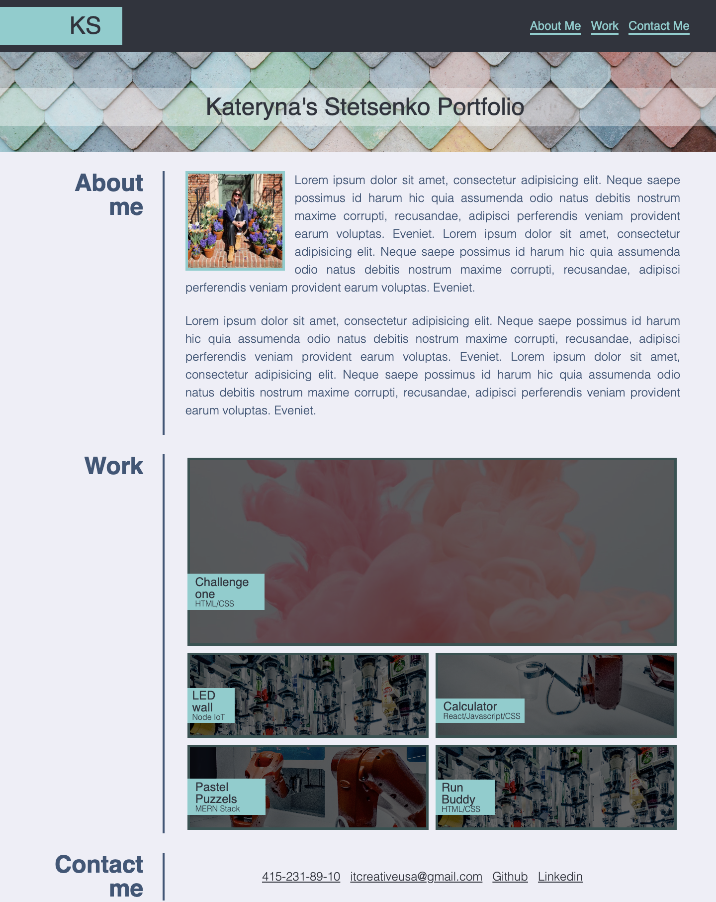

# My pretty portfolio Webpage

## Description

Link to deployed application
 https://itcreativeusa.github.io/my-pretty-portfolio/

Github link 
https://github.com/itcreativeusa/my-pretty-portfolio

This My-pretty-portfolio website was created as a boot camp every week student challenge. This website is an HTML & CSS portfolio page. The code of this portfolio page was created from scratch.
Website contains: 
- Logo text
- Navigation menu 
- About Section & recent photo 
- Portfolio section
- Footer navigation

## Table of Contents (Optional)

- [Installation](#installation)
- [Usage](#usage)
- [Requirements](#requirements)
- [Credits](#credits)
- [License](#license)

## Installation

N/A

## Requirements

No special requirements

## Usage

Screenshot located in ``` assets/images ``` folder


   

## Credits

Solution ``` object-fit: cover; ``` used in index.html file,
This solution resizes image to fit its container

The solution was found here:

https://www.w3schools.com/css/css3_object-fit.asp

Solution ```scroll-behavior: smooth``` used in style.css file,
This solution makes smooth scrolling was found here

https://gomakethings.com/smooth-scrolling-links-with-only-css/

The solution how to make hover over text was found here:

https://stackoverflow.com/questions/9913293/change-text-on-hover-then-return-to-the-previous-text

## License

Please refer to the LICENSE in the repo.


